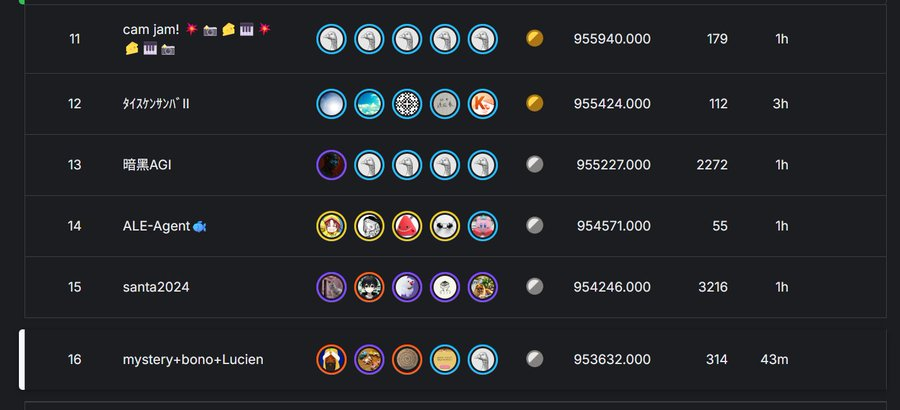

# Google Code Golf 2025 16th Place Solution

16 th place solution for the [Kaggle Code Golf competition](https://www.kaggle.com/competitions/google-code-golf-2025/overview) held from August to October 2025.



## Project Structure

```text
.
├── input/
│   ├── google-code-golf-2025/
│   │   ├── taskOO.json
│   │   └── code_golf_utils/
│   │       ├── show.py
│   │       └── verify.py
│   ├── submission1/
│   └── submission2/
├── code/
├── submission/
├── memo/
└── tool/
    ├── compcheck.py
    ├── varopt3.py
    ├── varopt2.py
    └── varopt.py
```

### Directory Descriptions

#### `input/`

Contains downloaded data from Kaggle and reference submissions.

- **`google-code-golf-2025/`**: Main dataset directory
  - **`taskOO.json`**: Task definition files downloaded from the Kaggle dataset (where `OO` represents the task number)
  - **`code_golf_utils/`**: Utility scripts (**Note**: modified from the original Kaggle dataset)
    - **`show.py`**: Visualizes task input/output examples
    - **`verify.py`**: Validates solutions against sample test cases

- **`submission1/`**: Solutions downloaded from the public notebook [ARC AGI Code Golf - 216/400 solved](https://www.kaggle.com/code/fedimser/arc-agi-code-golf-216-400-solved) (.json files not uploaded to repository due to .gitignore settings)

- **`submission2/`**: Solutions downloaded from the public notebook [Optimize 391/400 DSL](https://www.kaggle.com/code/lucvan68/optimize-391-400-dsl/output)

#### `code/`

Contains Python code solutions for each task. Note: Due to management issues during development, there may be inconsistencies between the `code/` and `submission/` directories. The `submission/` directory should be considered the authoritative version.

#### `submission/`

Contains compressed and optimized Python code for each task after processing. This directory is zipped for Kaggle submission.

#### `memo/`

Workspace directory containing intermediate code generated during the development of submission solutions.

#### `tool/`

Utilities for code optimization and compression.

- **`compcheck.py`**: Tests various compressors and parameters to find the optimal compression for each solution
- **`varopt3.py`**: Optimizes variable names for better compression (current version)

## Setup

1. Download the dataset from Kaggle
2. Place `taskOO.json` files in `./input/google-code-golf-2025/`
3. Run utility scripts from the project root directory

## Usage

**Important**: Always run commands from the project root directory.

### Verify Solutions

Validate that solutions pass the sample test cases:

```bash
# Single task
python ./input/google-code-golf-2025/code_golf_utils/verify.py <task_num>

# Range of tasks
python ./input/google-code-golf-2025/code_golf_utils/verify.py <task_num_start>..<task_num_end>
```

### Compression Check

Test different compression methods to find the shortest compressed size:

```bash
# Single task
python ./tool/compcheck.py <task_num> 2>/dev/null

# Multiple tasks in parallel
python ./tool/compcheck.py <task_num_start>..<task_num_end> 2>/dev/null
```

### Variable Name Optimization

Optimize variable names for better compression:

```bash
# Single task
python ./tool/varopt3.py --limit 131072 <task_num> > /dev/null

# Multiple tasks in parallel
seq 1 400 | xargs -P <process_count> -n 1 -I {} python ./tool/varopt3.py --limit 131072 {} > /dev/null
```

## Processing Pipeline

After placing code solutions in the `code/` directory, follow these steps:

1. **Verify correctness**: Run `./input/google-code-golf-2025/code_golf_utils/verify.py` to ensure all test cases pass

2. **Initial compression**: Run `./tool/compcheck.py` to generate compressed code for the first time

3. **Optimize variable names**: Run `./tool/varopt3.py` to optimize variable names based on the compressor type used by `compcheck.py`. This step utilizes the cache files created by `compcheck.py`.

4. **Final compression**: Run `./tool/compcheck.py` again to generate final compressed code. Unchanged files are automatically skipped for efficiency.

5. **Create submission**: Compress the `submission/` directory into a zip file and submit to Kaggle

**Important**: Always run `compcheck.py` before `varopt3.py`, as variable name optimization depends on the compression method and cache files created by `compcheck.py`.
